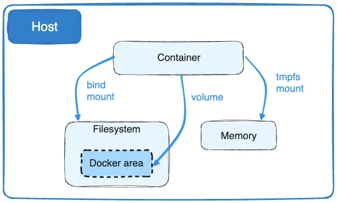

# Docker and all you need to know about it 🐋
Essenzialmente un documento inerente ciò che imparerò dal progetto 42 sul software docker:

## What's docker?
_an open-source project that automates the deployment of software applications inside containers by providing an additional layer of abstraction and automation of OS-level virtualization on Linux._
More efficent than a virtual machine.
More granular control over resources, and more efficiency over computer resources
Can be run anywhere.


## Where to learn 
https://tryhackme.com/r/room/introtocontainerisation
https://tryhackme.com/r/room/introtodockerk8pdqk
https://docs.docker.com/guides/docker-overview/

## Intro to containerisation 
Namespaces: is a process that it generates when a docker is on
the _docker pull_ command is used to download the images providing the name of the image.
so the syntax is
```bash
docker pull nginx
```
is even possible to add tag to the command to donwload a specific image, like for exsample if you'd like to download the latest version of ubuntu you do something like
```bash
docker pull ubuntu
```
but if you want a specified version you do
```bash
docker pull ubuntu:20.04
```

```bash
docker run [OPTIONS] IMAGE_NAME [COMMAND] [ARGUMENTS...]
```
the options between brackets [] are not required for a container to run.
In the future i will create a cheat sheet

## Starting with Docker
Docker è un micro leggero sistema operativo o micro computer il quale esegue determinate funzioni tramite dei container, i container contengono i cosidetti microservizi per far funzionare docker. 


**QUESTA PARTE VA APPROFONDITA DOPO AVER CAPITO DAVVERO CHE COS'È DOCKER**

Prima di tutto per far funzionare un container avremo **sempre** bisogno di un immagine da cui prendere spunto, la suddetta, a livello teorico conterrà le istruzioni per il container che dovrà eseguire in ordine per riuscire a funzionare.
The command _docker image_ 
 allows us to manage the images on our local system. To list the available options, we can simply do docker image to see what we can do. 

 Uno dei comandi fondamentali è **docker run**  questo comando è sempre eseguito con qualche opzione extra di conseguenza è molto importante perché darà il via all'esecuzione del nostro container


### Docker instructions
The Dockerfiles are an istruction manual for your containers, in them you can put some rules that will be executed by the container during the building process. It has even specific commands that it can give like for example:
* FROM
* RUN
* COPY
* WORKDIR
* CMD
* EXPOSE
  

### Docker compose
It allows multiple containers to interact with eachother


## 19 agosto 2024

Nella sezione di building delle immagini la flag -t viene usata per definire un tag ed essere più preciso su quale immagine vogliamo costruire avendo i tag per esempio potremmo distinguere due immagini con lo stesso nome ma di una versione diversa, per esempio
docker build -t <tag-name> 
Da capire effettivamente come funziona docker push pare che venga utilizzato a livello pratico penso sa solamente per il push delle immagini in docker hub ma aded sso vedo
"**share your images to the Docker Hub registry or to a self-hosted one**." Questo è quello che dice.
Andremo ad affrontare i seguenti topic:
* costruire un'immagine basandoci sul dockerfile
* Tagging images, daremo all'immagine un nome determinando dove l'immagine potrà essere distrbuita
* Pubblicare le immagini: il processo per distribuire le immagini attraverso l'utilizzo di un container registry

 **Nota per il futuro** capire a cosa potrebbe serviere fare "building without a context"

 Andiamo avanti.
 Con **docker build .** mettendo il . docker cercherà in quella sezione della cartella un possibile dockerfile per iniziare a costruire le immagini


 Passiamo al tagging delle immagini

### Tagging the images
Serve per evitare di lanciare i containers utilizzando il loro **completo codice univoco** per esempio:
sha256:8535b8aad53cf604a9d1c41726c7c5f3fc824bc5b0a93a6d08f0625f514240a3

un po' difficile da ricordare immagino ahaha, passando a come taggare queste immagini in verità esse hanno una struttura da seguire che sarebbe la seguente:
[HOST[:PORT_NUMBER]/]PATH[:TAG]
dove:
HOST _Opzionale_ nome dell'host dove l'immagine è locata, se non viene specificata alcuna immagine docker.io viene usata di default

PORT_NUMBER: Il numero del registro della porta se un hostname viene inserito
PATH: The path of the image, consisting of slash-separated components. For Docker Hub, the format follows [NAMESPACE/]REPOSITORY, where namespace is either a user's or organization's name. If no namespace is specified, library is used, which is the namespace for Docker Official Images.

TAG: l'effettivo nome dell'immagine

Per taggare effettivamente un'immagine fornendogli un nome proprio è necessario utilizzare la -t flag pòer esempio:
docker build -t my-username/my-image .
E con docker push <nome-immagine> l'immagine verrà inviata nei registri in dockerhub credo.


Ah ok la repository è solo per pushare le immagini se tu ne crei una in dockerhub risulterà vuota ecco perché l'esempio me ne ha fatta creare una e poi me l'ha fatta pushare si può anche fare così bata avere un account su docker hub ok ok chiaro


# Docker compose 🐙
Prima di comprendere veramente il funzionamento del docker compose dobbiamo analizzare effettivamente cosa sia questo docker compose.
A quanto pare è un file YAML ma che cos'è un file YAML appunto.
YAML è un linguaggio di codice utilizzato per i file di configurazione.
Per sicurezza e comodità utilizza "docker compose up" per far partire il file compose e non "docker-compose up" per evitare problemi di retrocompatibilità in parole povere il comando con il trattino è più aggiornato.
dobbiamo capire correttamente la gestione del compose, per capire davvero il compose bisogna capire il linguaggio yaml.

con "docker compose down" praticamente fermiamo tutti i container in una volta distruggendoli, ovviamente se vogliamo
## Mi raccomando se vuoi usare i dockerfile più aggiornati pulisci tutto prima
con
```bash
docker compose down -v --rmi all
```
e poi ricostruisci tutto con
```bash
docker compose up -d --build
```


Altra nota pare che per far comunicare i vari container tra di loro si utilizzi un network in comune tra i vari containers.
Infatti viene detto che:
_"In Docker, a network is a virtual software defined network that connects Docker containers. It allows containers to communicate with each other and the outside world, and it provides an additional layer of abstraction over the underlying network infrastructure."_

Quindi c'è un sistema di gestione virtuale che permette ai container di comunicare tra di loro.
Il classico network **bridge** permette ai vari container di comunicare tra di loro ma non di comunicare con il mondo esterno, questo comporta che nel caso io debba controllare se un mio servizio fatto partire da docker funziona su internet non posso semplicemente usare un docker bridge ma bensì devo anche esporre la porta che serve al container per farmici collegare.
**Devo anche trovare il modo per eliminare questi network per ordinare le stampe**

il network **the host** viene definito pigro praticamente quando un container viene deployato al host network non avendo il suo network personale si collega direttametne all'host del nostro computer, però questo comporta il fatto che il container non è isolato quindi è vulnerabile

**Il macVLAN** permette ai container di collegarsi direttamente al network fisico. 
Solo che la porta che il tuo host ha è solo una, quindi servirebbe che permettessi al tuo computer di gestirne di più tramite un'impostazione particolare.
e questo è uno dei due macVLAN.

**Overlay network** non viene approfonditò
**None** network praticamente non c'è nulla


# Concetti non compresi pienamente:
* Le altre modalità di macVlan
* ipvlan sembra particolare con le sue differenti modalità, non ho copreso bene l'utlizzo
* a livello concettuale penso che manchino alcuni pezzi prima della gestione network dei container, però sono abbastanza sicuro che se verranno menzionati nuovamente e utilizzati potrò comprendere meglio ipotetici esempi


# Check da fare con i container per pulire l'ambiente di lavoro correttamente 

## Le immagini e i container 🐳
Per vedere quali container stanno ancora andando o sono stati fermati:
```bash
docker ps -a
```
**This will show the container IDs, names, status (running or stopped), and other details about each container.**
puoi usare _docker inspect (id)_ per avere più informazioni riguardo quell'immagine.

Per quanto riguarda la costruzione di un'immagine quella potrà avvenire se avremo fatto il nostro Dockerfile con le istruzioni per costruirla. Dopodiché potremo eseguire il seguente comando all'interno della cartella dove risiede il nostro Dockerfile

```bash
sudo docker build -t customimage . 
```
la flag _-t_ è per dare un **tag** all'immagine per dargli un nome insomma, il "." è per dire al comando in che cartella eseguire il comando cioè quella in cui siamo già.
In seguito se la costruzione è stata un successo potremo lanciare il nostro servizio con il seguente comando:
```bash
sudo docker run -d -p portaHost:portaContainer contId
```
Da ora in poi il container continuerà ad essere operativo finché non decidiamo di fermarlo con il seguente comando
```bash
docker stop contId/contTag
```

E solo se fermato il container potrà essere rimosso con il seguente comando
```bash
docker rm 2a9172c8213f
```

Attenzione però ⚠️ il container si è stato eliminato però l'immagine che abbiamo costruito rimane nel caso volessimo far partire un altro container.
Nel caso volessimo eliminare l'immagine dovremmo controllare prima con _docker ps_ quali ci sono e poi con il seguente comando rimuoverla:
```bash
docker rmi <id>
```
## I volumi 🚚
Per vedere i volumi rimanenti
```bash
sudo docker volume ls
```

praticamente i **volumi** servono a docker per mantenere la persistenza in un container generato, come? perché sono interamente gestiti da docker.
Sono più comodi rispetto ai **bind mounts**, perché sono manualmente gestiti da docker.

Il gioco che fanno i volumi è mantenere la persistenza dei dati del container anche se quest'ultimo si fermasse o avesse dei problemi improvvisi.
tiene anche conto di come il container sia cambiato le impostazioni che gli sono state imposte, insomma è un salvataggio dello stato della macchina. E ricorda è completamente gestito dal software docker il  quale alla creazione del container se stabilito crea una cartella nella macchina host.
Puoi vedere i volumi con il comando 
```bash
sudo docker volume ls
```
in generali vedi quali volumi ci sono in gioco diciamo.
nel compose in realtà li definisci come li definiresti singolarmente con l'esecuzione dei container da linea di comando interessante.
I volumi vengono salvati sulla macchina e possono essere condivisi tra i vari container 

## I networks 🌐
comando da fare per controllare quali network sono rimasti:
```bash
docker network ls
```
Comando per la rimozione di networks che non stanno venendo utilizzati:
```bash
docker network prune -f
```
Comando per la rimozione di un network a scelta
```bash
docker network rm <network_name_or_id>
```
notare che ovviamente ci sono dei network definiti di "default" che praticamente non possono essere eliminati, perché fanno parte del sistema chiave di Docker
## In sintesi ✍️
```bash
docker ps -a            # List all containers
docker network ls       # List all networks
docker volume ls        # List all volumes
docker images           # List all images
docker info             # General system information
```


# Extras ✨

## La modalità interattiva 💻
Praticamente se il servizio è attivo (grazie all'esecuzione di docker run), possiamo fare un po' di debugging utilizzando per esempio il terminale del container.
Banalmente parlando il comando è il seguente:
```bash
docker exec -it <id> /bin/bash
```

Questo _/bin/sh_ dipende dal tipo di sistema operativo il container possiede nel nostro caso stiamo usando alpine che NON possiede bash di conseguenza utilizziamo sh

## Non riesco a mettere il servizio del mio container su di una porta specifica
Per ipotetiche inconvenienze con la disponibilità delle porte prese da possibili altri processi/container bisogna sempre controllare a quale porta vogliamo rendere disponibile il servizio.
Per questo io prima di fare il comando _sudo docker run_ controllo con il comando _sudo lsof -i :<porta_di_interesse>_ se quella porta è disponibile per il mio container, nel caso non lo fosse e volessi liberarla comunque mi bastera eseguire il comando
```bash
sudo systemctl stop <nome_del_processo_da_fermare>
```
ovviamente il <nome_del_processo_da_fermare> deve corrispondere a quello che leggiamo quando facciamo _lsof_

## Alcuni file indesiderati finisicono nel mio container finale 💢
significa che è ora di aggiungere un .dockerignore nella cartella dove hai il Dockerfile e al suo interno puoi mettere tutti i file che non ti servono nel docker container

## Docker compose up funziona ma il container non è visualizzabile con localhost online 💀
Ci sono vari modi per controllare se hai fatto le cose come si deve:
1. controlla che effettivamente il container possa essere costruito con il proprio dockerfile
2. potrebbe essere che il container non abbia la sua porta esposta correttamente ricontrolla il docker-compose perché se fosse così i vari container collegati funzionerebbero solo su una determinata connessione come menzionato qua: Make sure you run your service as `0.0.0.0:{port}` rather than `127.0.0.1:{port}`.


# Il subject 📰

## Nginx 🌐
Il primo container che dobbiamo costruire, secondo la guida per farlo non bisogna solo impostare la sua installazione all'iterno del dockerfile con RUN ma bensì fare anche la parte di configurazione per fare in modo sia operativo.
Tieni conto che per farlo funzionare effettivamente e vedere il risultato online dev'esserci il collegameto alla porta 443 definita comunque grazie al file di configurazione di nginx predefinito, è reperibile. 

## Mariadb 📑
Devo ancora capire la struttura di come fare questo container, molto probabilmente centra con il setting delle tabelle.

come configurarlo?

